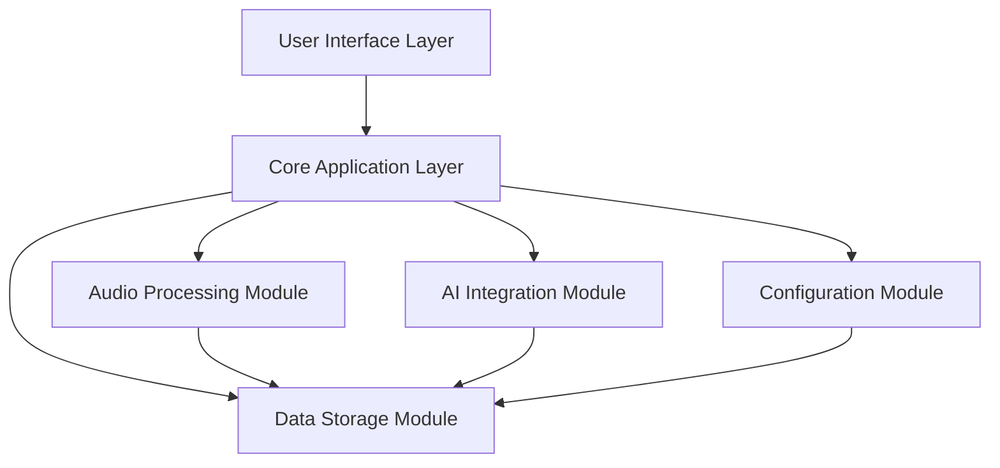

# Design Document

## Overview

The Call Summary AI application is built on Electron with a modular architecture that separates concerns between audio processing, AI integration, data management, and user interface. The design emphasizes reliability, security, and professional user experience while maintaining extensibility for future enhancements.

## Architecture

### High-Level Architecture



### Technology Stack

- **Frontend**: HTML5, CSS3, JavaScript (ES6+)
- **Backend**: Electron (Node.js)
- **Audio Processing**: Web Audio API, MediaRecorder API
- **AI Integration**: REST APIs (OpenAI, Azure, Google Gemini, DeepSeek)
- **Data Storage**: Local file system with JSON and encrypted storage
- **UI Framework**: Custom CSS with modern design system

## Components and Interfaces

### 1. Audio Recording System

#### AudioManager Class
```javascript
class AudioManager {
    // Device management
    async getAvailableDevices()
    async testDevice(deviceId)
    async requestPermissions()
    
    // Recording operations
    async startRecording(deviceId, options)
    async stopRecording()
    async pauseRecording()
    
    // Audio processing
    async processAudioBlob(blob)
    async convertToWav(blob)
    getAudioMetadata(blob)
    
    // Visualization
    startVisualization(canvas)
    updateAudioLevels()
}
```

#### Key Features
- Real-time audio level monitoring
- Multiple format support (WAV, MP3)
- Device hot-swapping detection
- Audio quality validation
- Waveform visualization

### 2. AI Integration System

#### AIServiceManager Class
```javascript
class AIServiceManager {
    // Provider management
    registerProvider(name, provider)
    getAvailableProviders()
    validateConfiguration(config)
    
    // Transcription services
    async transcribeAudio(audioBlob, provider, options)
    async pollTranscriptionStatus(jobId)
    
    // Text analysis services
    async generateSummary(transcript, template, provider)
    async processTemplate(transcript, template)
    async askQuestion(transcript, question, context)
    
    // Utility methods
    estimateTokens(text)
    estimateCost(provider, tokens)
    testConnection(provider)
}
```

#### Provider Implementations
- **AzureBatchTranscription**: Enterprise-grade transcription with speaker diarization
- **OpenAIWhisper**: Fast, reliable transcription service
- **AzureWhisper**: Enterprise Whisper deployment
- **OpenAIChat**: GPT models for text analysis
- **AzureOpenAI**: Enterprise GPT deployment
- **GoogleGemini**: Google's language models
- **DeepSeek**: Alternative language model provider

### 3. Template System

#### TemplateManager Class
```javascript
class TemplateManager {
    // Template operations
    async loadTemplates()
    async saveTemplate(template)
    async deleteTemplate(id)
    
    // Category management
    getTemplatesByCategory(category)
    createCategory(name, description)
    
    // Template processing
    processTemplate(template, variables)
    validateTemplate(template)
    
    // Import/Export
    exportTemplates(format)
    importTemplates(data)
}
```

#### Template Structure
```javascript
{
    id: "unique-identifier",
    name: "Template Name",
    description: "Template description",
    category: "summary|contacts|actions|analysis|custom",
    prompt: "AI prompt with {variables}",
    variables: ["transcript", "context"],
    metadata: {
        created: "timestamp",
        modified: "timestamp",
        author: "user",
        version: "1.0"
    }
}
```

### 4. Data Management System

#### DataManager Class
```javascript
class DataManager {
    // Recording management
    async saveRecording(audioBlob, metadata)
    async loadRecording(id)
    async deleteRecording(id)
    
    // History operations
    async getRecordingHistory(filters)
    async searchRecordings(query)
    async exportHistory(format)
    
    // Transcript management
    async saveTranscript(recordingId, transcript)
    async updateTranscript(recordingId, transcript)
    
    // Analysis storage
    async saveAnalysis(recordingId, templateId, result)
    async getAnalysisHistory(recordingId)
}
```

#### Data Storage Structure
```
~/.config/call-summary-ai/
├── recordings/
│   ├── 2024-01-15_meeting-001.wav
│   └── 2024-01-15_meeting-002.wav
├── transcripts/
│   ├── meeting-001.json
│   └── meeting-002.json
├── analysis/
│   ├── meeting-001/
│   │   ├── summary.json
│   │   └── actions.json
├── templates/
│   ├── default-templates.json
│   └── custom-templates.json
├── config.json
└── history.json
```

### 5. User Interface System

#### UIManager Class
```javascript
class UIManager {
    // Navigation management
    switchTab(tabName)
    updateActiveStates()
    
    // Modal management
    showModal(modalId, data)
    closeModal(modalId)
    
    // Notification system
    showNotification(message, type, duration)
    showProgress(operation, progress)
    
    // State management
    updateRecordingState(isRecording)
    updateTranscriptionState(status)
    updateAnalysisState(status)
}
```

#### Design System
- **Color Palette**: Professional blue/gray theme with semantic colors
- **Typography**: System fonts with clear hierarchy
- **Spacing**: 8px grid system for consistent layout
- **Components**: Reusable button, input, card, and modal components
- **Responsive**: Adaptive layout for different screen sizes

## Data Models

### Recording Model
```javascript
{
    id: "uuid",
    filename: "original-filename.wav",
    title: "User-defined title",
    timestamp: "ISO-8601 timestamp",
    duration: "duration in seconds",
    fileSize: "size in bytes",
    sampleRate: "audio sample rate",
    channels: "number of channels",
    deviceId: "recording device ID",
    metadata: {
        participants: ["name1", "name2"],
        tags: ["meeting", "client-call"],
        notes: "user notes"
    },
    transcription: {
        status: "pending|processing|completed|failed",
        provider: "provider name",
        text: "transcribed text",
        confidence: "confidence score",
        speakerDiarization: "speaker segments",
        processingTime: "time taken",
        error: "error message if failed"
    },
    analysis: [
        {
            templateId: "template-id",
            templateName: "Template Name",
            result: "analysis result",
            timestamp: "when analysis was performed",
            provider: "AI provider used"
        }
    ]
}
```

### Configuration Model
```javascript
{
    version: "1.0",
    audio: {
        defaultInputDevice: "device-id",
        defaultOutputDevice: "device-id",
        sampleRate: 44100,
        channels: 2,
        quality: "high"
    },
    transcription: {
        provider: "azure-batch|openai-whisper|azure-whisper",
        "azure-batch": {
            speechKey: "encrypted-key",
            region: "region",
            language: "en-US",
            enableDiarization: true
        },
        "openai-whisper": {
            apiKey: "encrypted-key",
            language: "auto"
        },
        "azure-whisper": {
            apiKey: "encrypted-key",
            endpoint: "endpoint-url",
            deployment: "deployment-name"
        }
    },
    summarization: {
        provider: "openai|azure-openai|gemini|deepseek",
        "openai": {
            apiKey: "encrypted-key",
            model: "gpt-4o-mini"
        },
        "azure-openai": {
            apiKey: "encrypted-key",
            endpoint: "endpoint-url",
            deployment: "deployment-name"
        },
        "gemini": {
            apiKey: "encrypted-key",
            model: "gemini-1.5-flash"
        },
        "deepseek": {
            apiKey: "encrypted-key",
            model: "deepseek-chat"
        }
    },
    ui: {
        theme: "auto|light|dark",
        notifications: true,
        autoSave: true,
        defaultExportFormat: "json"
    },
    privacy: {
        dataRetention: "30-days",
        autoDelete: false,
        encryptStorage: true
    }
}
```

## Error Handling

### Error Categories
1. **Audio Errors**: Device access, recording failures, format issues
2. **Network Errors**: API connectivity, timeout, rate limiting
3. **Processing Errors**: Transcription failures, AI processing errors
4. **Storage Errors**: File system access, disk space, corruption
5. **Configuration Errors**: Invalid settings, missing credentials

### Error Handling Strategy
```javascript
class ErrorHandler {
    handleAudioError(error) {
        // Provide device-specific guidance
        // Offer alternative devices
        // Show permission request UI
    }
    
    handleNetworkError(error) {
        // Implement retry logic
        // Show offline mode options
        // Cache requests for later
    }
    
    handleProcessingError(error) {
        // Offer alternative providers
        // Suggest manual alternatives
        // Preserve partial results
    }
}
```

### User-Friendly Error Messages
- Clear, non-technical language
- Actionable solutions
- Links to help documentation
- Option to report issues
- Automatic error recovery where possible

## Testing Strategy

### Unit Testing
- Audio processing functions
- AI service integrations
- Data management operations
- Template processing logic
- Configuration validation

### Integration Testing
- End-to-end recording workflow
- AI provider connectivity
- File system operations
- UI state management
- Cross-platform compatibility

### User Acceptance Testing
- Recording quality validation
- Transcription accuracy testing
- Template effectiveness evaluation
- Performance benchmarking
- Accessibility compliance

### Performance Testing
- Large file handling (up to 2GB)
- Memory usage monitoring
- CPU utilization optimization
- Network request efficiency
- UI responsiveness measurement

## Security Considerations

### Data Protection
- Local-only storage by default
- Encrypted API key storage
- Secure file permissions
- Memory cleanup after processing
- No telemetry or tracking

### API Security
- Secure credential management
- Request signing where required
- Rate limiting compliance
- Error message sanitization
- Connection encryption (HTTPS)

### Privacy Compliance
- Clear data handling notices
- User consent for AI processing
- Data retention controls
- Secure deletion procedures
- Audit trail maintenance

## Performance Optimization

### Audio Processing
- Streaming audio processing
- Background transcription
- Chunked file uploads
- Progressive loading
- Memory-efficient codecs

### UI Responsiveness
- Virtual scrolling for large lists
- Lazy loading of components
- Debounced user inputs
- Optimistic UI updates
- Background task management

### Resource Management
- Automatic cleanup of temporary files
- Memory leak prevention
- CPU usage monitoring
- Disk space management
- Network bandwidth optimization

## Accessibility Features

### Keyboard Navigation
- Full keyboard accessibility
- Custom shortcut configuration
- Focus management
- Skip navigation links
- Keyboard shortcuts help

### Screen Reader Support
- Semantic HTML structure
- ARIA labels and descriptions
- Live region updates
- Alternative text for images
- Descriptive link text

### Visual Accessibility
- High contrast mode support
- Scalable font sizes
- Color-blind friendly palette
- Focus indicators
- Reduced motion options

## Deployment and Distribution

### Build Process
- Electron Builder configuration
- Code signing for security
- Automated testing pipeline
- Cross-platform builds
- Update mechanism

### Platform Support
- Windows 10/11 (x64)
- macOS 10.15+ (Intel/Apple Silicon)
- Linux (Ubuntu 18.04+, AppImage)
- Consistent feature parity
- Platform-specific optimizations

### Update Strategy
- Automatic update checks
- Incremental updates
- Rollback capability
- Update notifications
- Offline update support